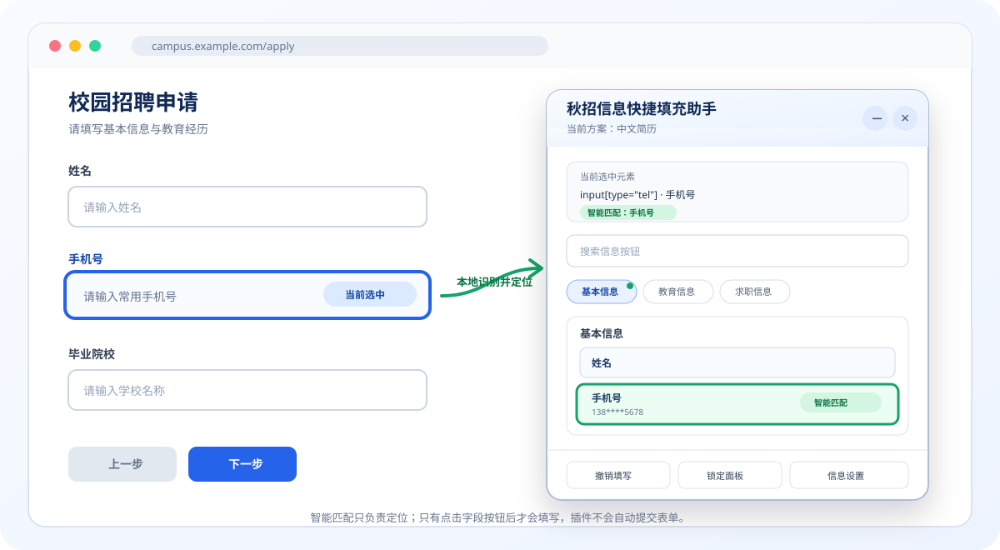

<p align="center">
  
</p>

<h1 align="center">秋招信息快捷填充助手</h1>

<p align="center">
  把常用简历信息安全地保存在本机，填写招聘网站时点一下即可复用。
</p>

<p align="center">
  <code>Chrome / Chromium Edge</code>
  ·
  <code>Manifest V3</code>
  ·
  <code>本地优先</code>
  ·
  <code>不自动提交</code>
</p>

---

## 1. 它能做什么

秋招信息快捷填充助手是一款面向校园招聘、实习申请和日常表单填写的浏览器扩展。你可以提前保存姓名、手机号、学校、专业、求职方向等信息；填写网页时，先点击输入框，再从悬浮面板中点击对应字段完成填入。



> 智能匹配只负责帮你定位按钮。插件不会自动填值、切换到下一项或提交表单，每次填写都需要你主动点击。

## 2. 功能亮点

| 功能 | 说明 |
| --- | --- |
| 🎯 智能匹配 | 根据当前输入框的类型、名称、占位文字、ARIA 标签和附近文字，在本地识别可能对应的字段，并自动滚动到按钮附近。 |
| 🧭 分组快速导航 | 在面板顶部展示“基本信息”“教育信息”“求职信息”等现有分组，点击即可平滑跳转。 |
| 🖱️ 手动确认填写 | 只有点击字段按钮后才会读取该字段的值并写入当前控件，避免误填。 |
| 🔍 搜索与折叠 | 支持搜索字段、折叠分组、拖动面板、折叠整个面板。 |
| 👥 多套信息方案 | 可分别维护中文简历、英文简历、技术岗位、国企岗位等方案。 |
| 📅 日期格式切换 | 日期和月份字段可配置多种输出格式；原生日期控件会自动转换为浏览器要求的格式。 |
| ↩️ 撤销填写 | 可恢复插件最近一次填写前的值，不占用或拦截网页的 `Ctrl+Z`。 |
| 🔒 临时 PIN 锁定 | 可在当前标签页锁定面板；锁定后隐藏字段按钮，也不会读取或填写数据。 |
| 📦 备份与迁移 | 支持导入、导出 JSON，恢复默认字段模板，以及双重确认清空。 |

默认提供 3 个分组和 24 个常用字段模板，包括姓名、手机号、邮箱、学校、专业、学历、毕业时间、期望岗位等。模板中的实际值均为空，需要首次使用时自行填写。

## 3. 快速安装

当前版本通过源码目录安装，尚未发布到 Chrome Web Store 或 Edge Add-ons。

### Chrome

1. 下载或克隆本项目，解压后确认目录中存在 `manifest.json`。
2. 在地址栏打开 `chrome://extensions`。
3. 打开右上角的“开发者模式”。
4. 点击“加载已解压的扩展程序”。
5. 选择包含 `manifest.json` 的项目目录。
6. 建议把扩展固定到浏览器工具栏，方便随时打开。

### Microsoft Edge

1. 下载或克隆本项目，解压后确认目录中存在 `manifest.json`。
2. 在地址栏打开 `edge://extensions`。
3. 打开“开发人员模式”。
4. 点击“加载解压缩的扩展”。
5. 选择包含 `manifest.json` 的项目目录。
6. 建议把扩展固定到浏览器工具栏。

更新源码后，请回到扩展管理页点击本扩展的“重新加载”按钮。

## 4. 首次设置

1. 在扩展管理页打开“扩展选项”，或在网页悬浮面板底部点击“信息设置”。
2. 选择默认的“中文简历”，也可以新建一套信息方案。
3. 点击字段右侧的“编辑”，填写实际值。
4. 按需标记敏感字段；敏感字段在悬浮面板中只显示掩码预览。
5. 使用上移、下移按钮调整分组和字段顺序。

所有修改都会自动保存在当前浏览器的本地扩展存储中。

## 5. 日常使用

1. 打开需要填写的招聘网站。
2. 点击浏览器工具栏中的扩展图标，网页右侧会出现悬浮面板。
3. 点击一个需要填写的输入框。支持的目标会显示蓝色边框。
4. 插件会尝试智能匹配：
   - 高置信度匹配时，自动展开对应分组并滚动到字段按钮；
   - 无法确定时，不会强行推荐，可使用顶部导航栏或搜索框查找。
5. 点击字段按钮完成填写。
6. 检查网页中的最终结果，尤其是日期、下拉框和网站自定义控件。
7. 如果填错，可点击“撤销填写”恢复最近一次操作。

再次点击工具栏图标可以显示或隐藏面板。关闭或刷新网页后，需要重新选择输入框。

## 6. 智能匹配如何工作

插件会在当前页面本地分析你所选择控件的少量描述信息，包括：

- 控件类型，例如 `email`、`tel`、`date`；
- `name`、`id`、placeholder；
- ARIA 标签；
- 对应或附近的 label；
- 常见的中英文字段别名。

只有当匹配结果足够明确时，面板才会自动滚动并显示“智能匹配”。智能匹配不会读取整份网页内容，不会把控件信息上传，也不会自动触发填写。

对于带编号的重复条目，插件还会比较字段名称的语义主干，并忽略常见的连接词、修饰词和职责类同义表达。例如，“论文信息”可以定位到“论文名称1、论文名称2……”，“项目中职责”“项目责任”或“在项目中承担的主要工作”可以定位到“项目职责1、项目职责2……”。同组存在多个候选时会优先高亮第一个，方便继续手动选择。

## 7. 分组快速导航

悬浮面板会根据当前方案展示所有已有分组：

- 点击分组名称：清除搜索过滤、展开分组并滚动到附近；
- 手动滚动字段列表：导航栏会同步标记当前所在分组；
- 智能匹配成功：对应分组会显示匹配标记；
- 分组名称和顺序：可在“信息设置”中自由修改。

## 8. 支持范围

| 控件或场景 | 支持情况 |
| --- | --- |
| 普通文本、邮箱、电话、数字、网址、搜索框 | 支持 |
| 日期与月份输入框 | 支持，并按控件要求转换格式 |
| `textarea` | 支持 |
| 原生 `select` | 支持，按 option 的 `value` 或完整显示文本精确匹配 |
| `contenteditable` | 支持纯文本写入，不插入 HTML |
| 常见 React / Vue / Angular 受控文本框 | 尽量兼容，会触发标准输入事件 |
| 自定义下拉框、级联选择器、富文本编辑器 | 不保证支持 |
| 密码、文件上传、验证码、银行卡、支付控件 | 主动拒绝填写 |
| 只读或已禁用控件 | 不填写，并显示原因 |

## 9. 架构概览

| 组件 | 职责 |
| --- | --- |
| Manifest V3 Service Worker | 响应扩展图标点击、按需注入面板，并按字段读取本地配置 |
| 网页悬浮面板 | 选择目标控件、展示字段与分组导航，并在用户点击后执行填写 |
| 智能匹配模块 | 在当前页面本地分析控件描述，只负责定位和高亮候选字段 |
| `chrome.storage.local` | 保存信息方案、分组、字段及当前会话的 PIN 摘要 |

- 扩展不会在所有网站常驻运行；只有点击工具栏图标后才向当前标签页注入面板。
- 面板位于 Shadow DOM 中，尽量避免与招聘网站的样式互相影响。
- 网页面板不会一次性取得全部真实字段值；点击某个按钮时才向后台请求该字段。
- 更详细的技术实现、目录说明和测试清单见 [开发者手册](INTRO.md)。

## 10. 隐私说明

- 简历信息只存储在 `chrome.storage.local`，不会使用云同步。
- 插件没有服务器、账号系统、遥测、统计、广告或远程脚本。
- 插件不会上传简历信息、网页表单内容或使用记录。
- 敏感字段在面板中使用掩码显示；真实值只在点击对应字段时读取。
- 临时 PIN 只保存 SHA-256 摘要，不持久化明文 PIN。
- 插件不会在控制台打印字段值或 PIN。
- 插件不会自动提交表单，也不会绕过验证码或网站安全机制。

> 本地存储不等于强加密。请勿在插件中保存账号密码、银行卡号、CVV、支付密码、短信验证码或其他高价值凭证。

## 11. 权限解释

本扩展只申请 3 项权限：

| 权限 | 用途 |
| --- | --- |
| `activeTab` | 仅在你点击扩展图标后，临时访问当前标签页。 |
| `scripting` | 按需注入本地面板脚本，用于选择控件和执行填写。 |
| `storage` | 在本机保存信息方案、分组、字段，以及当前会话的 PIN 摘要。 |

扩展没有申请 `<all_urls>`、浏览历史、Cookie、下载或网络请求权限，也没有 `host_permissions`。

## 12. 备份、恢复与卸载

### 导出备份

在“信息设置”页面点击“导出 JSON”。导出的文件包含完整配置和实际字段值，请妥善保管，不要上传到公共网盘、公开仓库或聊天群。

### 导入备份

点击“导入 JSON”并选择之前导出的文件。导入会覆盖当前全部配置，执行前会要求确认。

### 恢复默认模板

“恢复默认模板”会重建当前方案的默认字段，当前方案已有字段和值将被覆盖。

### 卸载前

卸载扩展或清除浏览器扩展数据可能删除所有本地配置。需要保留信息时，请先导出 JSON 备份。

## 13. 常见问题

### 点击扩展图标后没有出现面板

请先确认当前页面不是以下受限制页面：

- `chrome://` 或 `edge://` 浏览器内部页面；
- Chrome Web Store、Edge Add-ons；
- 浏览器或单位策略禁止扩展注入的页面。

如果在本地 HTML 文件上测试，请在扩展详情页打开“允许访问文件网址”。

### 点击输入框后没有智能匹配

智能匹配只在结果足够明确时生效。字段标签过于简短、网站使用自定义控件，或当前方案删除了默认字段时，插件可能不推荐。此时可以使用分组导航或搜索框手动定位，填写功能不受影响。

### 智能匹配到了错误字段

不要点击推荐按钮，直接使用分组导航或搜索选择正确字段。插件不会因为推荐结果而自动填写。

### 字段按钮显示“未设置”

打开“信息设置”，为当前方案中的字段填写实际值并保存。

### 原生下拉框提示“未找到对应选项”

插件不会模糊猜测下拉选项。请把字段值设置为目标 option 的实际 `value`，或完整的显示文本。

### 日期格式不正确

在字段编辑页面配置日期格式变体，并在悬浮面板中选择需要的格式。原生 `input[type=date]` 和 `input[type=month]` 必须使用浏览器规定的 ISO 格式。

### 网站使用 React 或 Vue，但页面状态没有更新

插件会调用原生 value setter，并触发 `beforeinput`、`input`、`change` 事件，可兼容常见受控输入框。但部分网站使用自定义状态机或拦截事件，此类实现可能仍无法兼容。

### 忘记了临时 PIN

PIN 不以明文保存，无法找回。关闭对应标签页，或结束并重新启动浏览器会话后，锁定记录会失效。

### 信息会在多台电脑之间同步吗

不会。当前版本只使用本地存储。如需迁移，请在可信设备之间手动导出和导入 JSON。

## 14. 已知限制

- 不支持跨域 iframe 中的表单；
- 无法访问 closed Shadow DOM 内的控件；
- 不支持 Canvas 绘制的输入控件；
- 非原生下拉框、日期选择器、级联选择器和富文本编辑器可能无法填写；
- 招聘网站主动阻止或重写输入事件时，填充可能失败；
- 临时 PIN 是隐私遮挡功能，不是数据加密或账户认证；
- 当前版本需要通过开发者模式加载，尚未提供扩展商店安装包。

## 15. 开发与测试

- 当前版本：`1.1.1`
- 最低 Chrome 版本：`102`
- 开发者文档：[INTRO.md](INTRO.md)
- 本地测试页面：`test/test-form.html`
- 智能匹配回归测试：

```bash
node test/smart-match.test.js
```

## 16. 使用提醒

本插件用于减少重复输入，不代替你检查信息。提交招聘申请前，请核对所有字段、附件、日期、隐私条款和网站提示。
